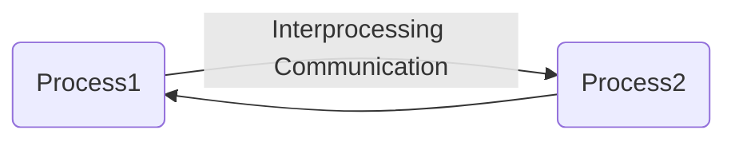
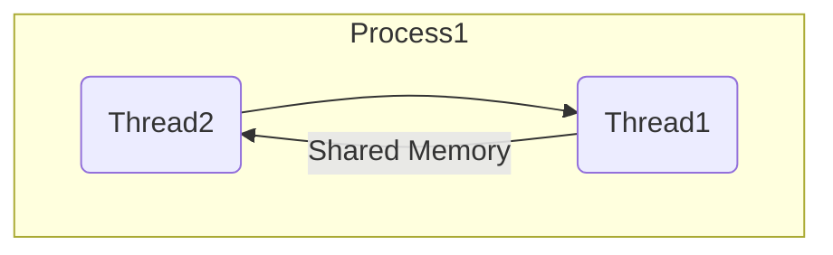

# Section 01 - Introduction to Concurrent Programming
Generally speaking, there are two kinds of concurrent programming models: ***Multi-processing*** & ***Multi-threading***.


## Multi-processing
For multi-processing, each process has only one thread running, and other processes communicate to each other through the regular **interprocess communication channel** such as ***files***, ***pipes***, ***message queues***...etc.




## Multi-threading
For multi-threading, one process contains two or more threads, and all of threads communicate with each other through **share memory**.




- ### Advantages of Multi-threading
A thread is faster to start, it is usually slow and complicated to start a process, because the operating system needs to devote a bunch of internal resources to manage the process. A thread is considered as a **lightweight process**.

Secondly a thread takes lower overhead in running, a process has more overhead. One example of that is the operating needs to provide a lot of protection so that one process will not accidentally step onto another process.

Communicating through shared memory is a lot faster than interprocess communication channels.

In summary, multi-threading provides better performance than multi-processing.


- ### Disadvantages of Multi-threading
Multi-threading is difficult to implement. There are a bunch of threading specific issues that needs to be carefully handled.

Multi-threading program cannot be run on the distributed system, while a multi-processing program can be easily distributed to multiple computers and run concurrently. For that reason, some people argue that even for multi-threading, the thread should not communicate through shared memory. They should use kind of channels that is similar to interprocess communication channels. That ways, your program can be easily converted to a multi-processing program and run on a distributed system when is a necessary, but also the programming becomes much easier, there are a lot less subtle problem needs to be handled.

In practice, it is more likely that you will see a mixture of both multi-threading and multi-processing models. Within the same program, some processes are single threaded, and some processes are multi-threaded.

We will mainly talk about multi-threading because that's what the C++ standard library provides.


## Implementing Multi-threading using `std::thread`
`std::thread` is a class that is defined in `<thread>`. Each of `std::thread` object represents a single thread of execution. Threads allow multiple functions to execute concurrently.

In this example, we're creating a standard thread `t1` and take a function reference `hi` as a parameter. Then we called `t1.join()`, this means the main thread waits for `t1` to finish:
```
#include <iostream>
#include <thread>

void hi() {
    std::cout << "hi" << std::endl;
}

int main() {
    std::thread t1(hi);     // t1 starts running
    t1.join();              // main thread waits for `t1` to finish
}
```
If we run the program, it prints out the message `hi`, but now this message is printed out by the child thread `t1`. So now we have two threads running, the main thread and a child thread `t1`:
```
hi
```

Now suppose `t1` is a long running thread, and my main thread doesn't want to wait for `t1` to finish becauses it has its own business to take care. So instead of calling `t1.join()`, we're going to call `t1.detach()`:
```
int main() {
    std::thread t1(hi);     // t1 starts running
    t1.detach();            // run freely on its own -- daemon process
}
```
By doing that, we have separated the connection between the main thread and `t1`. `t1` will run freely on its own, which means `t1` becomes a **daemon process**. When `t1` is finished because the main thread is no longer connected to the child thread, so the C++ runtime library will be responsible to reclaim the resource of `t1`. Some demon processes will continue running until the system shut down.

If we run the program, it'll not going to print out `hi`. It is because the main thread has run so fast that it actually finished before `t1` prints out of the message. So `t1` didn't get the chance to deliver its message to the `std::cout`. This is very characteristic of concurrent programming. If you have two threads running independently, it is typically not deterministic which thread will run faster unless we put in some **synchronization mechanism**.

In our particalur case, it is actually more deterministic because the main thread after creating `t1`, it almost does nothing and then finish. So the main thread should finish very quickly, but `t1` is a new thread that needs to be created. As we said, a thread is a lighter weight than a process, but it still takes time and effort to create a thread. So in our case, that main thread will almost always finish faster than the child thread.

So if two threads are sharing certain resource, in this case, a `std::cout`, then the thread that owns that resource, in this case, the main thread, should live as long as the other thread is accessing that resource.


- ### Detached Thread Cannot Join Again
You can join or detach a thread only once. For example, now we have detached our child thread `t1` and some time later we want to join with our child again. We cannot treat our child like that. Once detached, forever detached.
```
int main() {
    std::thread t1(hi);     // t1 starts running
    t1.detach();            // t1 will run freely on its own -- daemon process
    ...
    t1.join();              // error, will crash your program
}
```


- ### Checking Thread is Joinable using `.joinable()`
There is a way for us to test if a thread is joinable by using `.joinable()` member function. In this case, if `t1` is joinable, we call the function `.join()`.
```
int main() {
    std::thread t1(hi);     // t1 starts running
    t1.detach();            // t1 will run freely on its own -- daemon process

    if(t1.joinable())
        t1.join();
}
```
We're still not able to rejoin with our child thread, but at least our program will not crash.


# Section 02 - Thread Management
Last time we've take about that a thread should be either join or detach only once. But if a thread is neither join nor detach, the thread will be destroyed before join or detach, then our program will terminate. So we have make a decision whether you want to join the thread or detach the thread before it go out of scope:
```
int main() {
    std::thread t1(hi);
}
```

Let's say we want to join the thread:
```
int main() {
    std::thread t1(hi);
    t1.join();
}
```


### Thread Not Join if Exception Throw
In the main thread, after created the `t1` thread and before join with `t1`, it must do some work, otherwise, we're not getting any benefit of threading. 

Let's say a thread start counting integer `i`. Now `func_1()` is just a regular function inside a deeper calling stack, while the parent thread is doing its work, it throws an exception `i == 99`. Then again, the thread object `t1` will be destroyed before it is joined:
```
void count_ints() {
	for (int i = 0; i < 10; i++)
		std::cout << i << std::endl;
}

void func_1() {
	std::thread t1(count_ints);
	for (int i = 10; i < 100; i++) {
		std::cout << i << std::endl;
		if (i == 99) throw 1;           // thread stopped here
	}
	t1.join();
}

int main() {
	try {
		func_1();
	}
	catch (...) {
		std::cout << "99 error occur" << std::endl;
	}
}
```

So we need to wrap up at the parent threads work with a `try`-`catch` block. This will make sure `t1` will be joined with or without exception:
```
void count_ints() {
	for (int i = 0; i < 10; i++)
		std::cout << i << std::endl;
}

void func_1() {
	std::thread t1(count_ints);
	try {
		for (int i = 10; i < 100; i++) {
			std::cout << i << std::endl;
			if (i == 99) throw 1;       // must has a value, i.e. `1`
		}
	}
	catch (...) {
		t1.join();                      // `t1` thread has to be joined at first
		throw;                          // re-throw
	}
	t1.join();
}

int main() {
	try {
		func_1();
	}
	catch (...) {
		std::cout << "99 error occur" << std::endl;
	}
}
```
**#Re-Throw** - You can throw an exception without specifying any arguments or expression within the throw statment. The is called ***re-throw***, where the current caught exception is throw again to propagate it further up the call stack. The re-throw statement must be within the `catch`-block, this will re-throw the original exception caught by the `catch`-block, allowing other appropriate `catch`-blocks higher in the call stack to handle it.


### Wrapping Thread with RAII
An alterntive approach is using ***Resource Aquisition Is Initialization* (RAII)** approach. We can create a wrapper class that wraps around the `t1`, and in the **destructor** of the wrapper class will call that `t1.join()`. So whenever `w` goes out of scope, it will automatically join the thread.
```
int main() {
    std::thread t1(hi);
    Wrapper w(t1);          // using RAII
}
```


### Constructing `std::thread` Object with Functor Object
A thread object can be constructed not only with a regular function like `hi`, but also with **any callable object**, such as ***functor*** or ***lambda* function**.

Suppose we have a functor `Fctor`, and this functor will also do counting. In the `main()` function, we can instantiate `Fctor` object:
```
class Fctor {
public:
    void operator()() {
        for(int i = 0; i > -100; --i) {
            std::cout << "from t1 " << i << stdl::endl;
        }
    }
}

int main() {
    Fctor fct;
    std::thread t1(fct);        // t1 starts running

    t1.join();
}
```


### Constructing `std::thread` Object with Functor Constructor
Some people may want to save a line of code. Instead of creating the `fct` and pass it up to the thread, we can just create the `Fctor` object on the fly. This will not work as you expected and it won't even compile:
```
class Fctor {
public:
    void operator()() {
        for(int i = 0; i > -100; --i) {
            std::cout << "from t1 " << i << stdl::endl;
        }
    }
}

std::thread t1(Fctor());        // it won't compile
```
What do we're done over here is not creating a thread of `t1`. Instead, we're declaring a function with the function name `t1`. Under this function takes a single parameter, which is **a pointer to another function**, and this function takes no parameter and return a `Fctor`. And then the function `t1` returns a thread. This is known as the most vexing syntax in **C++**, because the **C++ standard** says whenever a statement can be interpreted as a function declaration. It will be treated as function declaration.

The solution is to add aonther pair of parenthese to make it explicitly that this is constructing a functor and pass it as parameter to the constructor of `t1`:
```
std::thread t1((Fctor()));
```


### Constructing `std::thread` Object with Function that Takes Parameter
So far, our threads has been functions or functors that takes no parameter. Now let's say we want to pass a parameter to the thread, say `Fctor` object takes a parameter of string `msg`, and in the `Fctor`, prints out that `msg`. The way to pass the string `s` to the thread is take `s` as this additional parameter of the thread's constructor:
```
class Fctor {
public:
    void operator()(std::string msg) {
        std::cout << "from t1: " << msg;
    }
};

int main() {
    std::string s = "Where there is no trust, there is no love\n";
    std::thread t1((Fctor()), s);

    try {
        std::cout << "from main: " << s;
    } catch(...) {
        t1.join();
        throw;
    }

    t1.join();
}
```
Let's say in the main thread, we also print out the message `s`. So if we run the program, both `t1` and main thread are printing the same message.
```
from main: Where there is no trust, there is no love
from t1: Where there is no trust, there is no love
```


### Constructing `std::thread` Object with Function that Takes Reference
Since the parameter is a stream, we want to pass it over by reference instead of by value so we can save a lot of copy. So we change the functor parameter to be passing by reference. But now the string `s` will be pass it over to the thread by value instead of by reference, because a parameter to a thread is always passed by value. To prove that, let's say we change the message to `"Trust is the mother of deceit."`:
```
class Fctor {
public:
    void operator()(std::string& msg) {                 // pass by reference
        std::cout << "from t1: " << msg;
        msg = "Trust is the mother of deceit\n";
    }
};

int main() {
    std::string s = "Where there is no trust, there is no love\n";
    std::thread t1((Fctor()), s);

    t1.join();
    std::cout << "from main: " << s << std::endl;
}
```
First, we want to make sure that `t1` has finished its job by calling the `join()` function, and then print out `s`.

Let's run the program:
```
from main: Where there is no trust, there is no love
from t1: Where there is no trust, there is no love
```
So you see, the message `"Trust is the mother of deceit."` is not printed out to the screen.

If you really want to pass the stream by reference to the thread, you have to use `std::ref()`. This create a reference wrapper for `s`:
```
int main() {
    std::string s = "Where there is no trust, there is no love\n";
    std::thread t1((Fctor()), std::ref(s));

    t1.join();
    std::cout << "from main: " << s << std::endl;
}
```
Now let's run the program again:
```
from t1: Where there is no trust, there is no love
from main: Trust is the mother of deceit
```
As you can see, `"Trust is the mother of deceit"` is printed out by main thread. Now we have create a situation where the child thread and the parent thread are sharing the same memory, which is the string `s`.


- ### Passing Argument by Pointer Using `std::move()`
Suppose `s` is no longer used in the main thread, and we don't want to share the memory between the thread because the memory sharing creates database problem, and we don't like to pass `s` by value either because passing by value is inefficient.

There is another way to achieve the same thing. Instead of passing `s` over by reference, we can pass it over by good old pointer using `std::move()` function.
```
class Fctor {
public:
    void operator()(std::string& msg) {
        std::cout << "from t1: " << msg;
        msg = "Trust is the mother of deceit\n";
    }
};

int main() {
    std::string s = "Where there is no trust, there is no love";
    std::thread t1((Fctor()), std::move(s));                        // move pointer

    t1.join();
}
```
This will move the `s` from the main thread to the child thread. This is both safe and efficient.

In C++ library, there are many things that can only be moved, and cannot be copied. As a matter of fact, the thread object itself can only be moved. So if we create another thread called `t2` and assign `t1` to this `t2`, this will **NOT** compile because thread cannot be copied:
```
    std::thread t1((Fctor()), std::move(s));
    std::thread t2 = t1;                        // compiler error
```
If we really want to transfer the ownership of a thread from `t1` to `t2`, we have to use the `std::move()` function again:
```
    std::thread t1((Fctor()), std::move(s));
    std::thread t2 = std::move(t1);             // transfer the thread from `t1` to `t2`
    t2.join();
```
So now we have to call `t2.join()` because `t1` is empty now.


- ### Getting Thread ID from Main Thread (Parent Thread)
Each thread has an identification number assoicated with it. To print out that number of the parent thread **ID**, we can use `std::this_thread::get_id()` function:
```
    std::cout << std::this_thread::get_id() << std::endl;
```


- ### Getting Thread ID from Child Thread
To print out the child thread **ID**, we can do `.get_id()` method of `std::thread` object. For example:
```
    std::thread t1((Fctor()), std::move(s));
    std::cout << t1.get_id() << std::endl;
```

Or we can do the `std::this_thread::get_id()` inside the child thread. For example:
```
class Fctor {
public:
    void operator()(std::string& msg) {
        std::cout << "from t1: " << msg;
        std::cout << std::this_thread::get_id() << std::endl;       // get child thread's ID
    }
};

int main() {
    std::string s = "Where there is no trust, there is no love";
    std::thread t1((Fctor()), std::move(s));

    t1.join();
}
```


- ### Getting Number of Thread of Computer
Let's say we have a very complicated problem to solve, how many thread should we create to solve that problem. Ideally, we should create as many number of threads as the number of calls that we have. We don't want to run more threads than we can support. That's called ***oversubscription***. Oversubscription is bad, because when there are more threads running than available CPU cores, it create a lot of ***context switch***, too many of ***context switching*** will degrade our performance. That's why the C++ library provide a function called `std::thread::hardware_concurrency()`.
```
std::cout << std::thread::hardware_concurrency() << std::endl;      // 6 (for example)
```
This will give us an indication of how many threads can be truely running concurrently for our program. For example, it might give me the number of CPU cores. So this can be a useful guide for splitting tasks among the threads.


# Section 03 - Data Race and Mutex
We're going to talk about ***race condition***, particularly the ***data races*** and how to solve them with ***mutex***.


## Race Condition - Data Race
Let's start with the example program. We have a function called `function_1()`, which counted from `0` downward to `-100`. In the `main()` function, we created a thread of `t1` with `function_1`, and then we count from `0` upward to `100`. And then we wait for `t1` to finish:
```
#include <thread>
#include <string>

void function_1() {
    for(int i = 0; i > -100; i--)
        std::cout << "From t1: " << i << std::endl;
}

int main() {
    std::thread t1(function_1);

    for(int i = 0; i < 100; i++)
        std::cout << "From main: " << i << std::endl;
    
    t1.join();
}
```
Let's us run the program. As you can see, the output from this program is pretty messed up:
```
...
From t1: From main: 61
-56
From main: 62
From main: 63
From main: 64
From t1: From main: 65
-57
From main: 66
From t1: -58
From main: From t1: -59
67
From t1: -60
From t1: -61
From t1: From main: 68
-62
...
```
The reason it happens this way is because we have two threads running, and both threads are racing for the common resource, the `std::cout`. A ***race condition*** is a condition where the outcome of a program depends on the relative execution order of one or more threads. And typically, race condition is not good for our program. We should try to avoid it.


## Solving Race Condition using Mutex
Note that `std::mutex` and `std::lock_guard` are defined in `<mutex>`.

One way to solve the race condition is using ***mutex*** to synchronize the access of the common resource among a group of threads, in this case, `std::cout`.

First, we need to create a `std::mutex` object. Then before we insert the message into the `std::cout`, we have to **lock the mutex at first**. So that while it's printing the message, other thread will not be able to print the message. **After it's printing, it will unlock the mutex**, so that the other thread can lock the mutex and print their message.
```
#include <thread>
#include <string>
#include <mutex>

std::mutex mu;

void shared_print(std::string msg, int id) {
    mu.lock();
    std::cout << msg << id << std::endl;
    mu.unlock();
}

void function_1() {
    for(int i = 0; i > -100; i--)
        shared_print(std::string("From t1: "), i);
}

int main() {
    std::thread t1(function_1);

    for(int i = 0; i < 100; i++)
        shared_print(std::string("From main: "), i);

    t1.join();
}
```
Now the access of the common resource `std::cout` is synchronized with the ***mutex* `mu`**, it should never happen that two threads are using `std::cout` at the same time. As long as they are use `shared_print()` function for printing.

If we run the program, everything is printed out beautifully:
```
...
From t1: -83
From main: 84
From t1: -84
From main: 85
From t1: -85
From main: 86
From t1: -86
From main: 87
From t1: -87
From main: 88
From t1: -88
From main: 89
From t1: -89
From main: 90
From t1: -90
...
```

However, there is a problem with this, what if this line of code throws an exception. Then our mutex `mu` will end up being locked forever:
```
void shared_print(std::string msg, int id) {
    mu.lock();
    ...                 // throw exception
    mu.unlock();
}
```

So it is **not** recommended to use the mutex `.lock()` and `.unlock()` function directly. Instead, we can use a `std::lock_guard<std::mutex>`. For example:
```
void shared_print(std::string msg, int id) {
    std::lock_guard<std::mutex> guard(mu);      // RAII
    std::cout << msg << id << std::endl;        // throw exception
}
```
Here we are using ***Resource Acquisition Is Initialization* (RAII)** technique. Whenever the `guard` goes out of scope, the mutex `mu` will always be unlocked with or without exception.

There is another problem with this program, the resource `std::cout` is not completely under the protection of the mutex `mu`, because `std::cout` is a global variable so other thread can still use `std::cout` directly without going through the `.lock()`.

In order to protect the resource completely, a mutex must be bundled together with the resource it is protecting. 

So a more realistic example is like this. Let's say we have a class `LogFile`, and `LogFile` have a `std::mutex` `m_mutex`. And `std::ofstream` `f`, which are protected by the ***mutex***. And its constructor opens up a ***log file*** `log.txt`, and let's ignore the destructor for now. And it also has a similar print function `shared_print()`, which use a `std::lock_guard` and a `std::mutex` to protect the access of `f`:
```
class LogFile {
    std::mutex m_mutex;
    std::ofstream f;            // ofstream is private
public:
    LogFile() {
        f.open("log.txt");
    }   // Need destructor to close file
    
    void shared_print(std::string id, int value) {
        std::lock_guard<std::mutex> locker(m_mutex);
        f << id << value << std::endl;
    }
};

void function_1(LogFile& log) {                     // take `LogFile` as reference
    for(int i = 0; i > -100; i--)
        log.shared_print(std::string("From t1: "), i);
}

int main() {
    LogFile log;                                    // create log file
    std::thread t1(function_1, std::ref(log));      // pass by reference

    for(int i = 0; i < 100; i++)
        log.shared_print(std::string("From main: "), i);
    
    t1.join();
}
```
In the `main()` function, we need to create a `LogFile` object called `log`, and then pass it to the thread `t1` by reference. And `function_1()` will take `LogFile` reference. And inside `t1`, we will call `log.shared_print()`. And this `main()` function will also called `log.shared_print()`.

Now the resource `f` is under the total protection of the mutex. Nobody can access `f` without going through the lock mechanism. However, you need to maintain this level of protection when you grow the class of `LogFile`.

There are things that you should never do, for example, you should never return `f` to the outside world. For example, you should **never** have a function like this:
```
class LogFile {
    std::mutex m_mutex;
    std::ofstream f;
public:
    LogFile() {
        f.open("log.txt");
    }   // Need destructor to close file
    void shared_print(std::string id, int value) {
        std::lock_guard<std::mutex> locker(m_mutex);
        f << id << value << std::endl;
    }
    // Never return `f` to the outside world
    std::ofstream& getStream() { return f; }        // bad practice
    void processf(void fun(ofstream&)) {            // bad practice
        fun(f);
    }
}
```
This is bad idea because user will have the opportunity to access `f` without going through the mutex. 

And you should never pass `f` as an argument to user provided function, because once you do that, this user defined function `fun` can do all the bad thing to the resource `f`, it can print things to `f` without going through the lock, it can copy `f` to a global variable so that everybody else can access `f` freely, it can close `f` so that nobody else write to `f` anymore. So the resource `f` is out of control.


## Thread Safe on Stack
Now let's assume we have used mutex to synchronize the access of our resource and we have followed all the good design guideline of not leaking the resource to the outside world. It still **cannot** guarantee that our program is thread safe.

Let's conside a **STL container** example. Let's consider the class `stack`. As we know, the class `stack` provides among other **APIs** a `pop()` function, which pops off the item on top of the stack. And the `top()` function return the item on top. And then it provides some other things `...`. And let's assume stack use integer array to store the data, and use `std::mutex` to protect the data:
```
class stack {
    int* _data;
    std::mutex _mu;
public:
    void pop();     // pops off the item on top of the stack
    int& top();     // returns the item on top
    ...
}
```
Let's assume both `pop()` and `top()` will access `_data` through the mutex, and then the `stack` doesn't do anything to leak data to the outside world. In `function_1()`, it will take `stack` reference called `st`. And in this `function_1`, it will do somthing like this:
```
void function_1(stack& st) {
    int v = st.top();
    st.pop();
    process(v)
}
```
This `function_1()` will be used to lunch a bunch of threads, and other threads will share the same data ***stack*** `st`. Now the question is: *"is this code thread safe?"*

Let's consider the case that we have two threads: ***thread A*** and ***thread B***. And we have a **stack** that contains `6`, `8`, `3`, and `9`.

| 6 |
| - |
| 8 |
| 3 |
| 9 |

***Thread A*** executed first, so it calls the method `.top()` and returns the data `6`. Then ***thread B*** calling method `.top()` and return `6` also. Then ***thread A*** calling `.pop()`, so `6` is pop out of the stack. Then thread B calling `.pop()`, `8` is pop out of the stack. After that, the ***thread B*** calling the process function and then the ***thread A*** calling the process function.
```
Thread A                            Thread B

int v = st.top();   // 6
                                    int v = st.top();   // 6
st.pop();           // 6 popped
                                    st.pop();           // 8 popped
                                    process(v);
process(v);
```
As you can see, the number `6` was process twice, and the number `8` was never process. Number `8` was lose. Apparently, our code is **NOT** thread safe. But we already have used mutex to synchronize the access of the data, and we have not leak our data to the user.

In this case, the culprit is actually the interface itself. The interface is designed in such a way that it is inherit not thread safe. **The operations `top()` and `pop()` should not be separated into two operations. They should be combined into one function**.

So the simple function is to **let the `pop()` function returns integer data**, and the `function_1()` will call `pop()` instead of `top()` to gather the data. Now this code is thread safe:
```
class stack {
    int* _data;
    std::mutex _mu;
public:
    int& pop();             // not `void`
    int& top();
}

void function_1(stack& st) {
    int v = st.pop();
    process(v);
}
```

Beware that `.pop()` may not be exception safe. That's why the **STL stack container's `pop()` function** doesn't return a value.


### Avoiding Data Race
To avoid data race, there are a couple of things you can do:

1. Use mutex to synchronize the data access
2. Never leak a handle of the data to outside
3. Design your interface properly
