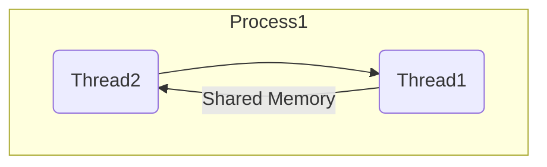

# Section 01 - Introduction to Concurrent Programming with C++ 11

Generally speaking, there are two kinds of concurrent programming models: ***Multi-processing*** & ***Multi-threading***.


## Multi-processing
For multi-processing, each process has only one thread running, and other processes communicate to each other through the regular **interprocess communication channel** such as files, pipes, message queues...etc.


## Multi-threading
For multi-threading, one process contains two or more threads, and all of threads communicate with each other through **share memory**.




- ### Advantages of Multi-threading
A thread is faster to start, it is usually slow and complicated to start a process, because the operating system needs to devote a bunch of internal resources to manage the process. A thread is considered as a **lightweight process**.

Secondly a thread takes lower overhead in running, a process has more overhead. One example of that is the operating needs to provide a lot of protection. So that one process will not accidentally step onto another process.

Communicating through shared memory is a lot faster than interprocess communication channels.

In summary, multi-threading provides better performance than multi-processing.


- ### Disadvantages of Multi-threading
Multi-threading is difficult to implement. There are a bunch of threading specific issues that needs to be carefully handled.

Multi-threading program cannot be run on the distributed system, while a multi-processing program can be easily distributed to multiple computers and run concurrently. For that reason, some people argue that even for multi-threading, the thread should not communicate through shared memory. They should use kind of channels that is similar to interprocess communication channels. That ways, your program can be easily converted to a multi-processing program and run on a distributed system when is a necessary, but also the programming becomes much easier, there are a lot less subtle problem needs to be handled.

In practice, it is more likely that you will see a mixture of both multi-threading and multi-processing models. Within the same program, some processes are single threaded, and some processes are multi-threaded.

We will mainly talk about multi-threading because that's what the C++ standard library provides.


## Using Multi-threading
In this example, we're creating a standard thread `t1` and take a function reference `hi` as a parameter. Then we called `t1.join()`, this means the main thread waits for `t1` to finish:
```
#include <iostream>
#include <thread>

void hi() {
    std::cout << "hi" << std::endl;
}

int main() {
    std::thread t1(hi);     // t1 starts running
    t1.join();              // main thread waits for `t1` to finish
}
```
If we run the program, it prints out the message `hi`, but now this message is printed out by the child thread `t1`. So now we have two threads running, the main thread and a child thread `t1`:
```
hi
```

Now suppose `t1` is a long running thread, and my main thread doesn't want to wait for `t1` to finish becauses it has its own business to take care. So instead of calling `t1.join()`, we're going to call `t1.detach()`:
```
int main() {
    std::thread t1(hi);     // t1 starts running
    t1.detach();            // t1 will run freely on its own -- daemon process
}
```
By doing that, we have separated the connection between the main thread and `t1`. `t1` will run freely on its own, which means `t1` becomes a **daemon process**. When `t1` is finished because the main thread is no longer connected to the child thread, so the C++ runtime library will be responsible to reclaim the resource of `t1`. Some demon processes will continue running until the system shut down.

If we run the program, it'll not going to print out `hi`. It is because the main thread has run so fast that it actually finished before `t1` prints out of the message. So `t1` didn't get the chance to deliver its message to the `std::cout`. This is very characteristic of concurrent programming. If you have two threads running independently, it is typically not deterministic which thread will run faster unless we put in some **synchronization mechanism**.

In our particalur case, it is actually more deterministic because the main thread after creating `t1`, it almost does nothing and then finish. So the main thread should finish very quickly, but `t1` is a new thread that needs to be created. As we said, a thread is a lighter weight than a process, but it still takes time and effort to create a thread. So in our case, that main thread will almost always finish faster than the child thread.

So if two threads are sharing certain resource, in this case, a `std::cout`, then the thread that owns that resource, in this case, the main thread, should live as long as the other thread is accessing that resource.


- ### Detached Thread Cannot Join Again
You can join or detach a thread only once. For example, now we have detached our child thread `t1` and some time later we want to join with our child again. We cannot treat our child like that. Once detached, forever detached.
```
int main() {
    std::thread t1(hi);     // t1 starts running
    t1.detach();            // t1 will run freely on its own -- daemon process
    ...
    t1.join();              // error, will crash your program
}
```

- ### Checking Thread is Joinable - `.joinable()`
There is a way for us to test if a thread is joinable by using `.joinable()` member function. In this case, if `t1` is joinable, we call the function `.join()`.
```
int main() {
    std::thread t1(hi);     // t1 starts running
    t1.detach();            // t1 will run freely on its own -- daemon process

    if(t1.joinable())
        t1.join();
}
```
We're still not able to rejoin with our child thread, but at least our program will not crash.


# Section 02 - Thread Management
